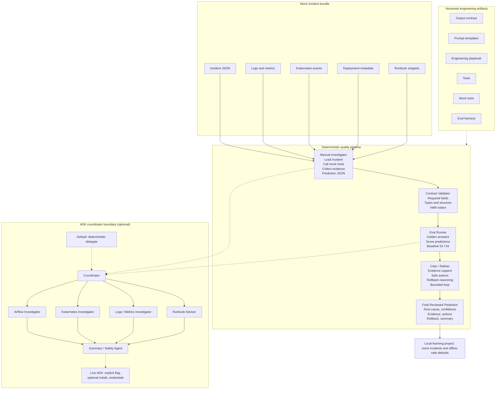

# Agent engineering workflow

This diagram shows how the **AI Platform Incident Copilot** capstone is structured:
mock incident data feeds a deterministic investigation path, quality gates score and verify
output, and an optional ADK coordinator boundary sits beside the baseline without replacing
it. Versioned engineering artifacts support every stage.

## Workflow diagram

## How to read it

**Solid arrows (default path)** follow the deterministic pipeline: mock data enters the
manual investigator, then passes through contract validation, eval scoring, and critic
review before producing a final prediction. This is the acceptance baseline and the path
documented in the demo walkthrough.

**Dashed arrows (guarded optional path)** connect to the ADK coordinator boundary. By
default the coordinator delegates to the same deterministic investigator. Live ADK
execution requires an explicit flag, optional `google-adk` install, and credentials. It
does not silently replace the offline path.

**Validation and evals are quality gates.** The output contract validator checks shape
and required fields. The eval runner scores predictions against golden answers (54 / 54
baseline). Both must pass before critic review is meaningful.

**Critic/refiner is a verification layer, not autonomous remediation.** It performs
deterministic checks on evidence support, action safety, rollback reasoning, and
uncertainty handling. It does not mutate infrastructure, call live LLMs, or execute
remediation actions.

**Versioned engineering artifacts** (contract, prompts, playbook, tests, mock tools, eval
harness) sit alongside the pipeline and define how each stage is built and verified.

## Related docs

* [Demo walkthrough](demo-walkthrough.md)
* [Learning summary](learning-summary.md)
* [Output contract](output-contract.md)
* [Agentic engineering playbook](agentic-engineering-playbook.md)
* [Prompt templates](../prompts/README.md)
