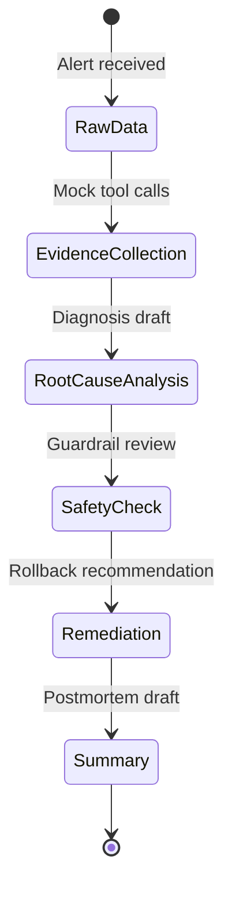

# Agentic Engineering theory -> Incident Copilot mapping

How concepts from *The New SDLC With Vibe Coding* map to the **AI Platform Incident
Copilot** capstone and portfolio goals.

## Mapping table

| Day 1 idea | Capstone design decision | Career / portfolio value |
| --- | --- | --- |
| **Agent loop** | Coordinator plans, calls tools, iterates | Beyond chat UX |
| **Tools** | Read-only mock tools under `data/` | Agent-ready platform interfaces |
| **Context engineering** | Specialist instructions, on-demand runbooks | Token-aware context design |
| **Harness engineering** | Sandbox, orchestration, guardrails, eval runner | Production harness mindset |
| **Evals** | `golden-answers.json` scorer before ADK agents | Test-driven AI for SRE work |
| **Guardrails** | Read-only tools, unsafe action blocklists | Safe on-call tooling |
| **Observability** | Traces, citations, score breakdown | Auditable incident review |
| **Conductor / orchestrator** | `IncidentCoordinatorAgent` delegates to specialists | Day 1b multi-agent pattern |
| **Factory model** | Incident -> evidence -> diagnosis -> actions -> summary | Pipeline architect role |
| **Deployment** | Future Cloud Run / ADK documented; v0 local mock | Prototype without premature deploy |
| **Memory** | `evidence_bundle`, `diagnosis_draft`, `remediation_plan`, `incident_summary` | Structured agent handoff |
| **Tests** | `unittest` for tools and eval runner | Deterministic foundation |

## Why deterministic tools and evals came first

1. **Evidence before opinions** - The capstone promise requires cited logs, metrics, and
   runbooks. Tools must return trustworthy, reproducible data before any LLM interprets
   it.
2. **Eval-first engineering** - Golden scenarios (`INC-001` to `INC-003`) define
   acceptance criteria. Building the scorer first prevents moving goalposts when agents
   are added.
3. **Harness before model** - Day 1 emphasizes that behavior lives in tools, guardrails,
   and orchestration. Mock tools plus rubric are the harness skeleton.
4. **Public-safe iteration** - No credentials, billing, or live clusters required.
   Portfolio-ready without production risk.
5. **Debuggability** - When ADK agents arrive, failures split cleanly: bad tool data vs
   bad routing vs bad reasoning.

## Architecture alignment

```text
Day 1 paper                    Capstone v0
-------------                  -----------
Context engineering      ->     Mock incident bundles + runbooks
Harness                  ->     tools.py + eval_runner.py + AGENTS.md
Evals                    ->     golden-answers.json (deterministic)
Orchestrator mode        ->     IncidentCoordinatorAgent (future ADK)
Factory model            ->     Sequential reporting pipeline
Guardrails               ->     Read-only tools + unsafe action scoring
```

## Related docs

* [output-contract.md](./output-contract.md) - response fields and eval mapping
* [architecture.md](./architecture.md) - multi-agent design
* [Day 2 tools brief](./agentic-engineering-day-2-tools-interoperability.md) - concepts and glossary
* [notes/day-1-new-sdlc-summary.md](../../notes/day-1-new-sdlc-summary.md) - Day 1 concepts
* [notes/day-1b-agent-architectures.md](../../notes/day-1b-agent-architectures.md) - ADK
  workflow patterns

## Optional Mermaid: evidence pipeline



## Day 2 theory -> Incident Copilot mapping

Day 2 extends the Day 1 harness mindset with interoperability. The capstone should not
become a pile of custom wrappers, hidden prompts, or ungoverned agent calls. It should
stay protocol-shaped: bounded tools, explicit agent responsibilities, safe UI outputs, and
strict approval boundaries for any action with financial or operational impact.

| Day 2 idea | Capstone design decision | Career / portfolio value |
| --- | --- | --- |
| **MCP** | MCP-shaped mock tools: structured I/O, read-only | Interoperability thinking |
| **Discovery / configuration / connection** | Tool onboarding: trusted source, scoped access | Tool governance |
| **NxM integration problem** | Stable contracts across models and frameworks | Portability awareness |
| **MCP debugging** | Tests, traces, schema validation before prompts | Harness-first debugging |
| **Skills** | Repeatable workflows in AGENTS.md and docs | Consistent agent behavior |
| **A2A** | Coordinator and specialists as responsibilities; v0 local | Multi-agent without distribution |
| **Bounded vs unbounded domains** | Tools for evidence; agents for diagnosis | Systems vs reasoning split |
| **GOTO problem in agent architecture** | Clarification and routing in coordinator layer | No workflow engines in tools |
| **Agent Card** | Lightweight capability and boundary contracts | Agent interface design |
| **Agent Registry** | Documented index before runtime discovery | Docs-to-platform path |
| **A2UI** | Future component-shaped UI; v0 JSON plus markdown | Safe interactive UI path |
| **AP2 / UCP** | No commerce in v0; mandates for future paid actions | Financial risk handling |
| **Agent-as-a-Service** | Future specialists as platform capabilities | Platform and GenAI portfolio story |

## Day 1 vs Day 2 interpretation

Day 1 is about building the agent factory: harness, tools, evals, guardrails, memory,
orchestration, and observability.

Day 2 is about making that factory interoperable: standard tool interfaces,
specialist-agent contracts, safe UI generation, and explicit mandates for high-risk
actions.

For this capstone:

1. Day 1 explains why deterministic tools and evals come before LLM agents.
2. Day 2 explains how those tools and agents should be shaped so they can later connect
   to real systems without becoming custom integration debt.
3. Day 1 gives us the execution loop.
4. Day 2 gives us the protocol boundaries.

## Day 2 architecture alignment

```text
Day 2 paper                    Capstone interpretation
-------------                  -----------------------
MCP                     ->      Read-only structured incident tools
Skills                  ->      Repeatable repo and review playbooks
A2A                     ->      Coordinator plus specialist responsibilities
Agent Card              ->      Lightweight contracts for future agents
Agent Registry          ->      Documented index before runtime discovery
A2UI                    ->      Future incident timeline or dashboard UI
AP2 / UCP               ->      Guardrails for any future paid or purchase action
Mandate                 ->      Human-approved constraint for high-risk actions
```

## Day 2 design stance

The capstone should use Day 2 as architectural guidance, not as a requirement to
implement every protocol immediately.

Near-term scope:

1. Keep mock tools structured and read-only.
2. Keep tool calls auditable through investigation traces.
3. Add lightweight agent contracts before introducing real specialist agents.
4. Prefer stable JSON contracts over free-form hidden behavior.
5. Keep all external access scoped, trusted, and non-production.
6. Block payment-like or infrastructure-cost actions unless a human explicitly approves
   them.

Out of scope for v0:

1. Real MCP servers connected to production systems.
2. Remote A2A agents over the network.
3. Runtime agent registries.
4. Agent-generated executable UI.
5. Autonomous purchases, payments, SaaS upgrades, or cloud quota increases.
