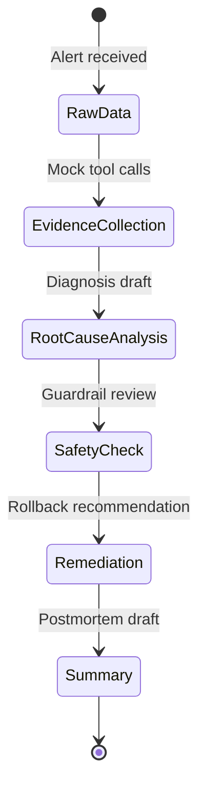

# Agentic Engineering theory → Incident Copilot mapping

How concepts from *The New SDLC With Vibe Coding* map to the **AI Platform Incident Copilot** capstone and portfolio goals.

## Mapping table

| Day 1 idea | Capstone design decision | Career / portfolio value |
|------------|--------------------------|---------------------------|
| **Agent loop** | Coordinator perceives incident → plans investigation → calls tools → observes evidence → iterates; Sequential stage produces final output | Shows iterative systems thinking, not chat-only UX |
| **Tools** | Deterministic read-only mock tools (`search_logs`, `get_metrics`, `get_k8s_events`, etc.) under `data/` | Demonstrates agent-ready interfaces for platform/MLOps roles |
| **Context engineering** | Per-specialist instructions; dynamic mock telemetry; runbook snippets loaded on demand | Token-aware, high-signal context design |
| **Harness engineering** | Tool sandbox (mock files only), orchestration patterns, guardrails, eval runner | Shows 90%-harness mindset for production AI |
| **Evals** | `evals/golden-answers.json` + deterministic scorer (18 pts/incident) before ADK agents | Test-driven AI - valued in SRE and platform engineering |
| **Guardrails** | Read-only tools; unsafe action blocklists; no destructive recommendations | Safe autonomous tooling for on-call scenarios |
| **Observability** | `investigation_trace`, tool citations, per-incident score breakdown | Auditable agent behavior for incident review |
| **Conductor / orchestrator** | LLM `IncidentCoordinatorAgent` delegates to specialists; human reviews final bundle | Multi-agent orchestration pattern from Day 1b |
| **Factory model** | Pipeline: incident bundle → investigation → evidence → diagnosis → safe actions → summary | Positions you as pipeline architect, not prompt hacker |
| **Deployment** | Documented for future Cloud Run / ADK; v0 local mock only | Shows path from prototype to service without premature deploy |
| **Memory** | State keys: `evidence_bundle`, `diagnosis_draft`, `remediation_plan`, `incident_summary` | Structured handoff between agents and stages |
| **Tests** | `unittest` for tools and eval runner | Deterministic foundation under non-deterministic agents |

## Why deterministic tools and evals came first

1. **Evidence before opinions** - The capstone promise requires cited logs, metrics, and runbooks. Tools must return trustworthy, reproducible data before any LLM interprets it.
2. **Eval-first engineering** - Golden scenarios (`INC-001` to `INC-003`) define acceptance criteria. Building the scorer first prevents moving goalposts when agents are added.
3. **Harness before model** - Day 1 emphasizes that behavior lives in tools, guardrails, and orchestration. Mock tools + rubric are the harness skeleton.
4. **Public-safe iteration** - No credentials, billing, or live clusters required. Portfolio-ready without production risk.
5. **Debuggability** - When ADK agents arrive, failures split cleanly: bad tool data vs bad routing vs bad reasoning.

## Architecture alignment

```text
Day 1 paper                    Capstone v0
─────────────                  ───────────
Context engineering      →     Mock incident bundles + runbooks
Harness                  →     tools.py + eval_runner.py + AGENTS.md
Evals                    →     golden-answers.json (deterministic)
Orchestrator mode        →     IncidentCoordinatorAgent (future ADK)
Factory model            →     Sequential reporting pipeline
Guardrails               →     Read-only tools + unsafe action scoring
```

## Related docs

* [output-contract.md](./output-contract.md) - response fields and eval mapping
* [architecture.md](./architecture.md) - multi-agent design
* [agentic-engineering-day-2-tools-interoperability.md](./agentic-engineering-day-2-tools-interoperability.md) - Day 2 concepts and glossary
* [notes/day-1-new-sdlc-summary.md](../../notes/day-1-new-sdlc-summary.md) - Day 1 concepts
* [notes/day-1b-agent-architectures.md](../../notes/day-1b-agent-architectures.md) - ADK workflow patterns

## Optional Mermaid: evidence pipeline



## Day 2 theory → Incident Copilot mapping

Day 2 extends the Day 1 harness mindset with interoperability. The capstone should not become a pile of custom wrappers, hidden prompts, or ungoverned agent calls. It should stay protocol-shaped: bounded tools, explicit agent responsibilities, safe UI outputs, and strict approval boundaries for any action with financial or operational impact.

| Day 2 idea                                 | Capstone design decision                                                                                                     | Career / portfolio value                                                   |
| ------------------------------------------ | ---------------------------------------------------------------------------------------------------------------------------- | -------------------------------------------------------------------------- |
| **MCP**                                    | Treat mock tools as MCP-shaped interfaces: structured inputs, structured outputs, clear scope, read-only behavior            | Shows tool interoperability thinking, not one-off API glue                 |
| **Discovery / configuration / connection** | Document tool onboarding rules: trusted source, scoped access, local/mock data first, no hardcoded credentials               | Demonstrates production-minded tool governance                             |
| **NxM integration problem**                | Keep stable tool contracts so future models or agent frameworks can reuse the same telemetry interfaces                      | Shows awareness of integration debt and model portability                  |
| **MCP debugging**                          | Use deterministic tests, tool traces, and schema validation before changing prompts                                          | Shows ability to debug the harness instead of blindly prompt-tuning        |
| **Skills**                                 | Keep repeatable workflows in AGENTS.md and skills-style docs: review rules, testing policy, safe execution rules             | Makes agent behavior reusable and consistent                               |
| **A2A**                                    | Model the coordinator and specialists as agent responsibilities, while keeping v0 local and deterministic                    | Shows multi-agent design without premature distributed complexity          |
| **Bounded vs unbounded domains**           | Use tools for bounded evidence retrieval; use agents for ambiguous diagnosis, tradeoffs, and incident narrative              | Shows clean separation between deterministic systems and reasoning systems |
| **GOTO problem in agent architecture**     | Do not hide multi-turn ambiguity inside tool wrappers. Keep clarification, routing, and state in the coordinator layer       | Prevents accidental workflow engines inside tools                          |
| **Agent Card**                             | Add lightweight agent contracts for future agents: capabilities, inputs, outputs, tools, boundaries, and unsupported actions | Shows professional agent interface design                                  |
| **Agent Registry**                         | Keep a simple documented index of available agents and tools before introducing any runtime registry                         | Shows pragmatic evolution path from docs to platform                       |
| **A2UI**                                   | Future incident dashboard or timeline can use component-shaped output. v0 stays with structured JSON plus markdown           | Shows safe path toward interactive agent-generated UI                      |
| **AP2 / UCP**                              | No commerce or payment behavior in v0. Any future paid action needs explicit human mandate, spend limit, and audit log       | Shows responsible handling of financial and operational risk               |
| **Agent-as-a-Service**                     | Position future specialist agents as reusable platform capabilities, not one-off scripts                                     | Supports portfolio story for platform, MLOps, and GenAI roles              |

## Day 1 vs Day 2 interpretation

Day 1 is about building the agent factory: harness, tools, evals, guardrails, memory, orchestration, and observability.

Day 2 is about making that factory interoperable: standard tool interfaces, specialist-agent contracts, safe UI generation, and explicit mandates for high-risk actions.

For this capstone:

1. Day 1 explains why deterministic tools and evals come before LLM agents.
2. Day 2 explains how those tools and agents should be shaped so they can later connect to real systems without becoming custom integration debt.
3. Day 1 gives us the execution loop.
4. Day 2 gives us the protocol boundaries.

## Day 2 architecture alignment

```text
Day 2 paper                    Capstone interpretation
─────────────                  ───────────────────────
MCP                     →      Read-only structured incident tools
Skills                  →      Repeatable repo and review playbooks
A2A                     →      Coordinator plus specialist responsibilities
Agent Card              →      Lightweight contracts for future agents
Agent Registry          →      Documented index before runtime discovery
A2UI                    →      Future incident timeline or dashboard UI
AP2 / UCP               →      Guardrails for any future paid or purchase action
Mandate                 →      Human-approved constraint for high-risk actions
```

## Day 2 design stance

The capstone should use Day 2 as architectural guidance, not as a requirement to implement every protocol immediately.

Near-term scope:

1. Keep mock tools structured and read-only.
2. Keep tool calls auditable through investigation traces.
3. Add lightweight agent contracts before introducing real specialist agents.
4. Prefer stable JSON contracts over free-form hidden behavior.
5. Keep all external access scoped, trusted, and non-production.
6. Block payment-like or infrastructure-cost actions unless a human explicitly approves them.

Out of scope for v0:

1. Real MCP servers connected to production systems.
2. Remote A2A agents over the network.
3. Runtime agent registries.
4. Agent-generated executable UI.
5. Autonomous purchases, payments, SaaS upgrades, or cloud quota increases.
