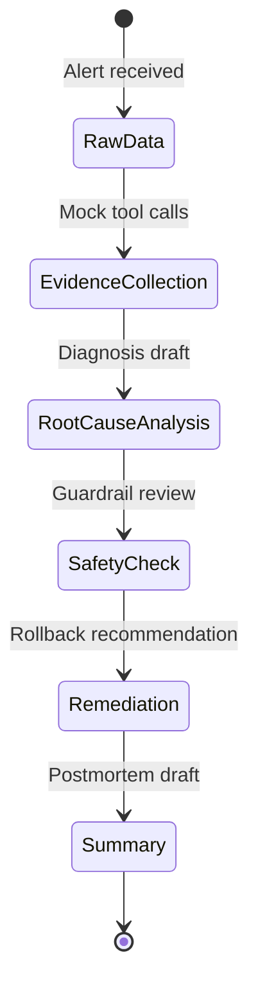

# Day 1 theory → Incident Copilot mapping

How concepts from *The New SDLC With Vibe Coding* map to the **AI Platform Incident Copilot** capstone and portfolio goals.

## Mapping table

| Day 1 idea | Capstone design decision | Career / portfolio value |
|------------|--------------------------|---------------------------|
| **Agent loop** | Coordinator perceives incident → plans investigation → calls tools → observes evidence → iterates; Sequential stage produces final output | Shows iterative systems thinking, not chat-only UX |
| **Tools** | Deterministic read-only mock tools (`search_logs`, `get_metrics`, `get_k8s_events`, etc.) under `data/` | Demonstrates agent-ready interfaces for platform/MLOps roles |
| **Context engineering** | Per-specialist instructions; dynamic mock telemetry; runbook snippets loaded on demand | Token-aware, high-signal context design |
| **Harness engineering** | Tool sandbox (mock files only), orchestration patterns, guardrails, eval runner | Shows 90%-harness mindset for production AI |
| **Evals** | `evals/golden-answers.json` + deterministic scorer (18 pts/incident) before ADK agents | Test-driven AI — valued in SRE and platform engineering |
| **Guardrails** | Read-only tools; unsafe action blocklists; no destructive recommendations | Safe autonomous tooling for on-call scenarios |
| **Observability** | `investigation_trace`, tool citations, per-incident score breakdown | Auditable agent behavior for incident review |
| **Conductor / orchestrator** | LLM `IncidentCoordinatorAgent` delegates to specialists; human reviews final bundle | Multi-agent orchestration pattern from Day 1b |
| **Factory model** | Pipeline: incident bundle → investigation → evidence → diagnosis → safe actions → summary | Positions you as pipeline architect, not prompt hacker |
| **Deployment** | Documented for future Cloud Run / ADK; v0 local mock only | Shows path from prototype to service without premature deploy |
| **Memory** | State keys: `evidence_bundle`, `diagnosis_draft`, `remediation_plan`, `incident_summary` | Structured handoff between agents and stages |
| **Tests** | `unittest` for tools and eval runner | Deterministic foundation under non-deterministic agents |

## Why deterministic tools and evals came first

1. **Evidence before opinions** — The capstone promise requires cited logs, metrics, and runbooks. Tools must return trustworthy, reproducible data before any LLM interprets it.
2. **Eval-first engineering** — Golden scenarios (`INC-001`–`INC-003`) define acceptance criteria. Building the scorer first prevents moving goalposts when agents are added.
3. **Harness before model** — Day 1 emphasizes that behavior lives in tools, guardrails, and orchestration. Mock tools + rubric are the harness skeleton.
4. **Public-safe iteration** — No credentials, billing, or live clusters required. Portfolio-ready without production risk.
5. **Debuggability** — When ADK agents arrive, failures split cleanly: bad tool data vs bad routing vs bad reasoning.

## Architecture alignment

```text
Day 1 paper                    Capstone v0
─────────────                  ───────────
Context engineering      →     Mock incident bundles + runbooks
Harness                  →     tools.py + eval_runner.py + AGENTS.md
Evals                    →     golden-answers.json (deterministic)
Orchestrator mode        →     IncidentCoordinatorAgent (future ADK)
Factory model            →     Sequential reporting pipeline
Guardrails               →     Read-only tools + unsafe action scoring
```

## Related docs

* [output-contract.md](./output-contract.md) — response fields and eval mapping
* [architecture.md](./architecture.md) — multi-agent design
* [notes/day-1-new-sdlc-summary.md](../../notes/day-1-new-sdlc-summary.md) — Day 1 concepts
* [notes/day-1b-agent-architectures.md](../../notes/day-1b-agent-architectures.md) — ADK workflow patterns

## Optional Mermaid: evidence pipeline


